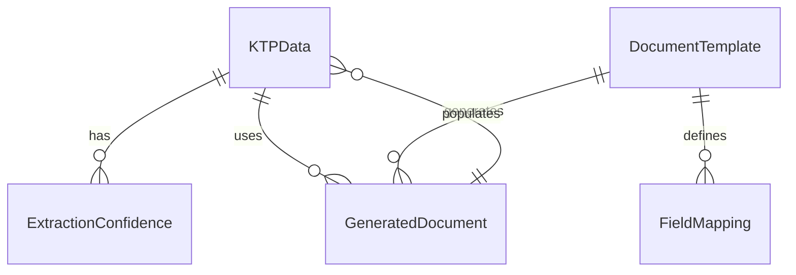
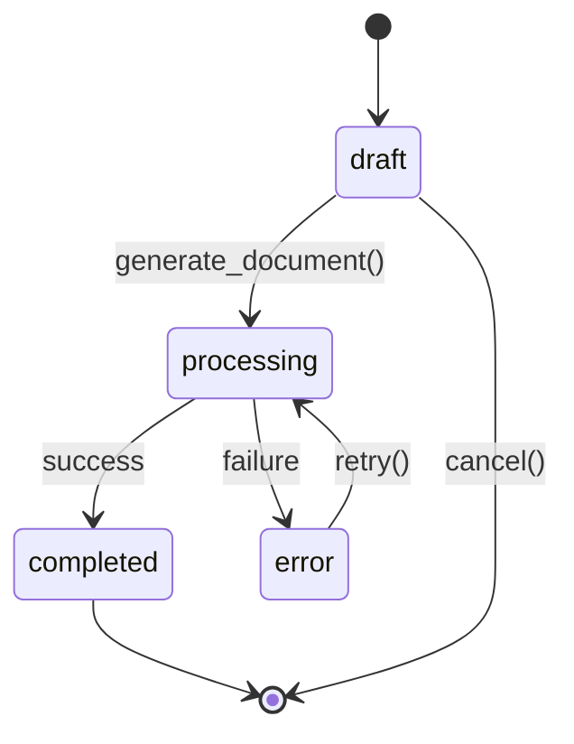

# Data Model: KTP Data Extraction and Document Population

**Date**: 2025-10-20  
**Feature**: KTP Data Extraction and Document Population  
**Spec**: [specs/001-ktp-extraction/spec.md](spec.md)

## Entities

### KTPData

Represents the extracted information from Indonesian ID cards.

**Fields**:
- `id` (string, UUID): Unique identifier for the KTP data record
- `nik` (string, 16 digits): Indonesian ID number (FR-008)
- `name` (string): Full name as shown on KTP
- `place_of_birth` (string): Place of birth
- `date_of_birth` (date): Date of birth in YYYY-MM-DD format
- `gender` (string): Gender (Laki-laki/Perempuan)
- `address` (string): Complete address
- `religion` (string): Religion
- `marital_status` (string): Marital status
- `occupation` (string): Occupation
- `validity_period` (string): Validity period
- `image_path` (string): Path to the original KTP image
- `created_at` (datetime): Timestamp when the record was created
- `updated_at` (datetime): Timestamp when the record was last updated

### ExtractionConfidence

Represents confidence scores for each extracted data field.

**Fields**:
- `id` (string, UUID): Unique identifier for the confidence record
- `ktp_data_id` (string, UUID): Foreign key to KTPData
- `field_name` (string): Name of the field (e.g., "nik", "name")
- `confidence_score` (float, 0.0-1.0): Confidence score for the extraction (FR-002)
- `extraction_method` (string): Method used for extraction (e.g., "tesseract", "manual")
- `created_at` (datetime): Timestamp when the record was created

### DocumentTemplate

Represents predefined document structures with field placeholders.

**Fields**:
- `id` (string, UUID): Unique identifier for the template
- `name` (string): Human-readable name of the template
- `description` (string): Brief description of the template purpose
- `template_type` (string): Type of document (e.g., "form", "application", "registration")
- `file_path` (string): Path to the template file
- `output_format` (string): Output format (DOCX, PDF) (FR-007)
- `created_at` (datetime): Timestamp when the template was created
- `updated_at` (datetime): Timestamp when the template was last updated

### FieldMapping

Represents the association between extracted KTP data fields and template field locations.

**Fields**:
- `id` (string, UUID): Unique identifier for the field mapping
- `template_id` (string, UUID): Foreign key to DocumentTemplate
- `ktp_field` (string): Name of the KTP data field
- `template_field` (string): Name or identifier of the template field
- `position_x` (integer, optional): X coordinate for positioning (if applicable)
- `position_y` (integer, optional): Y coordinate for positioning (if applicable)
- `created_at` (datetime): Timestamp when the mapping was created

### GeneratedDocument

Represents the final output document with KTP data populated in template fields.

**Fields**:
- `id` (string, UUID): Unique identifier for the generated document
- `template_id` (string, UUID): Foreign key to DocumentTemplate
- `ktp_data_id` (string, UUID): Foreign key to KTPData
- `file_path` (string): Path to the generated document file
- `output_format` (string): Format of the generated document (DOCX, PDF)
- `status` (string): Status of generation (e.g., "draft", "completed", "error")
- `created_at` (datetime): Timestamp when the document was generated
- `download_count` (integer): Number of times the document has been downloaded

## Relationships



## Validation Rules

### KTPData Validation

- `nik` must be exactly 16 digits (FR-008)
- `name` must not be empty
- `date_of_birth` must be a valid date in YYYY-MM-DD format
- `gender` must be either "Laki-laki" or "Perempuan"
- `address` must not be empty
- `religion` must be one of the recognized religions in Indonesia
- `marital_status` must be one of the recognized marital statuses in Indonesia

### ExtractionConfidence Validation

- `confidence_score` must be between 0.0 and 1.0
- `field_name` must correspond to a valid field in KTPData
- `extraction_method` must be a recognized extraction method

### DocumentTemplate Validation

- `name` must not be empty
- `template_type` must be a recognized template type
- `output_format` must be either "DOCX" or "PDF" (FR-007)
- `file_path` must point to an existing file

### FieldMapping Validation

- `ktp_field` must correspond to a valid field in KTPData
- `template_field` must correspond to a valid field in the associated DocumentTemplate

## State Transitions

### GeneratedDocument Status Flow



**State Descriptions**:
- `draft`: Initial state when document generation is requested but not yet started
- `processing`: Document is being generated with KTP data
- `completed`: Document has been successfully generated and is ready for download
- `error`: An error occurred during generation

**Transitions**:
- `generate_document()`: Initiates the document generation process
- `retry()`: Attempts to regenerate a document after an error
- `cancel()`: Cancels the document generation request

## Data Storage Format

All data will be stored in JSON format for file-based storage:

```
data/
├── ktp_data/
│   ├── {ktp_id}.json
├── templates/
│   ├── {template_id}.json
├── generated_documents/
│   ├── {document_id}.json
└── mappings/
    ├── {mapping_id}.json
```

## Privacy and Security Considerations

- All KTP data will be encrypted at rest as per NFR-003
- Access to KTP data requires authentication as per NFR-002
- Data will be stored indefinitely with explicit user consent as per NFR-001
- Original KTP images will be stored securely and only accessible to authorized users